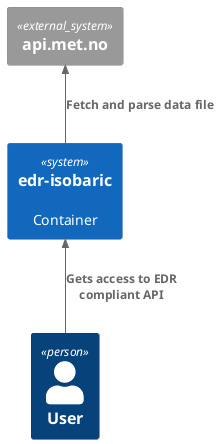

# C4

## Context diagram for edr-isobaric

```plantuml
@startuml
!include <C4/C4_Container>

System_Ext(api, "api.met.no")
System(edriso, "edr-isobaric", "Container")
Person(user, "User", "")

Rel_U(edriso, api, "Fetch and parse data file")
Rel_U(user, edriso, "Gets access to EDR compliant API")
@enduml
```
